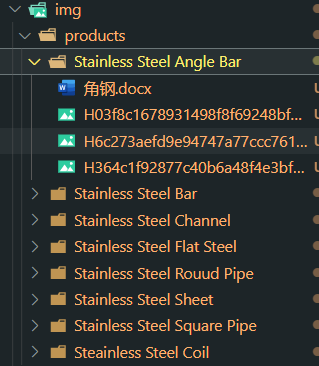
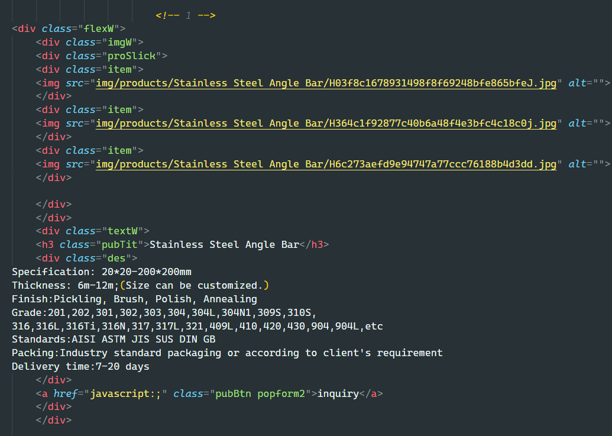

# 方便地获取目录内容
> 遍历如下目录结构获取文件和图片生成,如下HTML结构，用于解决前端程序员手动复制粘贴HTML结构





## 安装
```shell
composer require hdliyu/tools
```

## 用法

```php
require "vendor/autoload.php";
use Hdliyu\Tools\fetch\FetchFacade;
//FetchFacade::base(基础模板配置)->item(循环模板配置)->path(目录路径)->makeHtml();//修改默认配置
echo FetchFacade::makeText(); // 不保留docx格式
//echo FetchFacade::makeHtml(); // 保留docx格式
```

## 可用方法，链式调用

- base 设置默认字符串模板
- item 设置默认循环字符串模板
- path 设置目录位置
- config 同时设置以上三个
- makeHtml 生成带格式html结构
- makeText 生成不带格式html结构